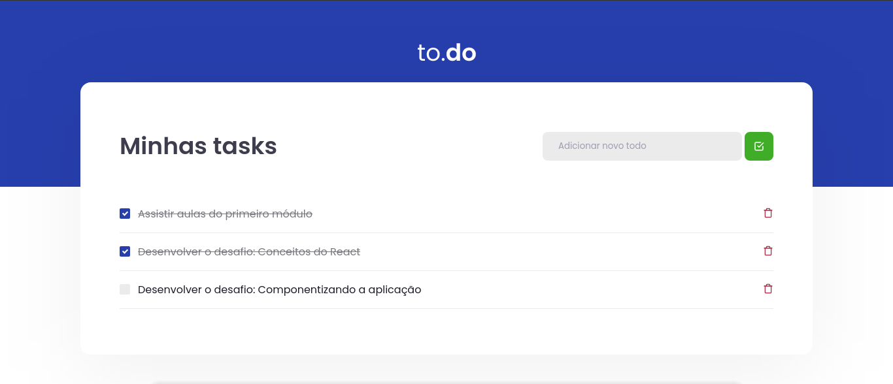

<h1 align="center">
 ⚛ Desafio: Conceitos do React
</h1>
<h3 align="center">
  🚀 Ignite | Trilha ReactJS
</h3>

<p align="center">
  <a href="https://www.rocketseat.com.br/" target="_blank">
     
   </a>
   
 
  

  <a href="https://app.rocketseat.com.br/me/goncadanilo">
    
  </a>
</p>

<p align="center">
  <a href="#-tecnologias">Tecnologias</a>&nbsp;&nbsp;&nbsp;|&nbsp;&nbsp;&nbsp;
  <a href="#-projeto">Projeto</a>&nbsp;&nbsp;&nbsp;|&nbsp;&nbsp;&nbsp;
  <a href="#-como-rodar">Como rodar</a>&nbsp;&nbsp;&nbsp;|&nbsp;&nbsp;&nbsp;
  <a href="#-licença">Licença</a>
</p>

<br>

<p align="center">
  
</p>

## 🚀 Tecnologias

Esse projeto foi desenvolvido com as seguintes tecnologias:

- [React JS](https://pt-br.reactjs.org/): Uma biblioteca JavaScript para criar interfaces de usuário.
- [Babel](https://babeljs.io/): Um compilador de código JavaScript.
- [Webpack](https://webpack.js.org/): Um empacotador de módulos JavaScript.
- [Sass](https://sass-lang.com/): Pré processador de CSS.

## 💻 Projeto

Nesse desafio, desenvolvi uma aplicação para treinar o que aprendi no módulo: **Fundamentos do ReactJS**.

Essa é uma pequena aplicação de atividades a fazer, a famosa to-do list, para treinar um pouco mais sobre manipulação do estado no React.

- [x] Adicionar uma nova tarefa
- [x] Remover uma tarefa
- [x] Marcar e desmarcar uma tarefa como concluída

## 🔧 Como rodar

É necessário ter instalado:
- [Git](https://git-scm.com)
- [Node.js](https://nodejs.org/)
- [Yarn](https://yarnpkg.com/)

### 🗂 Faça um clone do projeto

```bash
$ git clone https://github.com/goncadanilo/react-todo.git
```

### 📥 Instale as dependências
```bash
# Acesse o diretório do projeto
$ cd react-todo

# Instale as dependências
$ yarn
```

### ⚡ Inicie a aplicação
```bash
$ yarn dev
```

### ⚗ Teste a aplicação
Para rodar os testes (utilizados na correção do desafio) execute o comando:
```bash
$ yarn test
```

## 📝 Licença

Esse projeto está sob a licença MIT. Veja o arquivo [LICENSE](LICENSE) para mais detalhes.

---

Feito com ♥ by [Danilo Gonçalves](https://github.com/goncadanilo). Me adicione no [LinkedIn](https://www.linkedin.com/in/goncadanilo/) :wave:
